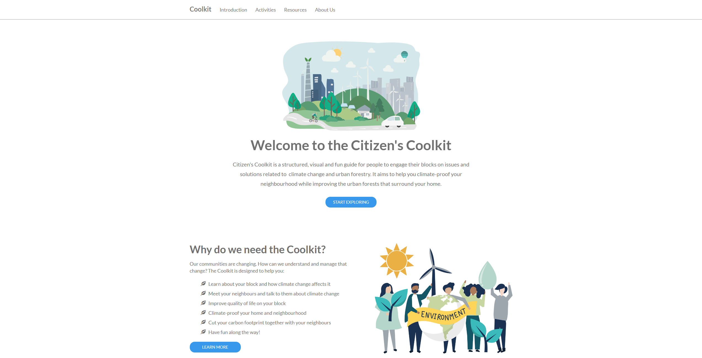

# :leaves: Coolkit

[Official website for the Coolkit](http://icoolkit.net)



## Installation
### Requirements
You'll need to install the following before you can run the application:
* [Node.js](https://nodejs.org/en/)

### Set up
Clone the repository:

```
git clone https://github.com/ubccalp/coolkit.git
```

Change into the directory with the package.json file and run: 

```
npm install
``` 

This will create a directory called node_modules and put within it the dependencies listed in the package.json file.

## Development
To start a server locally for development purposes, you can run either ```npm start``` or ```npm run dev``` (see [nodemon](https://nodemon.io)). The server will be listening on port 5000; the application should now be accessible at http://localhost:5000.